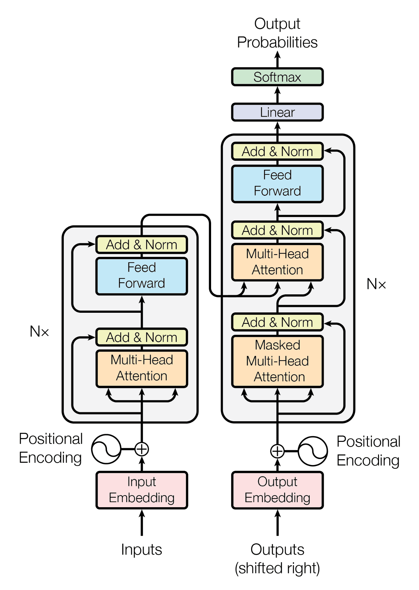

# Transformers Architecture Fundamentals


The Transformer (from the 2017 paper “Attention Is All You Need”) is the backbone of most modern LLMs.
### What is a Transformer?

A Transformer is a deep learning model designed to handle sequential data, such as text, without relying on recurrence or convolution. It uses an innovative mechanism called self-attention, which allows the model to dynamically focus on different parts of the input data based on context.

This architecture forms the foundation of many state-of-the-art models like BERT, GPT, and T5.

Note:
Transformer-:

    1. Deep Learning Model
    2. Handle Sequential Data (Text)
    3. (alternative of)/ (dont relay on) recurrence or convolution.
    4. Use innovative mechanism (self-attention)
    5. self-attention allow model to dynamic focus on different part of input data based on context.


### Key Components of a Transformer:
1. Encoder:
> The encoder processes the input sequence and converts it into a dense, contextualized representation. 

> The encoder essentially extracts meaningful features from the input sequence, capturing the relationships and dependencies between tokens.
    
2. Decoder
> The decoder generates the output sequence (e.g., a translated sentence) by attending to both the encoder's output and previously generated tokens.

> The decoder predicts one token at a time, iteratively refining its output.

3. Self-Attention Mechanism
> The self-attention mechanism is the core innovation of Transformers. It computes relationships between all tokens in a sequence, allowing the model to focus on the most relevant parts.

> This mechanism enables the model to dynamically weigh tokens, capturing long-range dependencies effectively.
    
4. Multi-Head Attention
> Instead of calculating a single attention score, multi-head attention uses multiple attention "heads" to capture various aspects of the input relationships. Each head operates independently, enhancing the model's ability to understand complex patterns.
    
5. Positional Encoding
> Since Transformers process the input sequence as a whole (not sequentially like RNNs), positional encoding is used to inject information about the order of tokens.

> This encoding ensures the model understands the sequence order.
    
6. Feedforward Neural Network (FFN)
>   Each token's representation is independently processed through a feedforward neural network:
> - A linear transformation to increase dimensionality.
> - A non-linear activation function (e.g., ReLU).
> - Another linear transformation back to the original dimension.

7. Add & Norm
> The Add & Norm operation stabilizes the training process:

> - Add: Residual connections ensure gradient flow, preventing vanishing gradients.
> - Norm: Layer normalization standardizes intermediate outputs, improving model stability.

8. Masking
> Transformers employ masking to handle padding and sequential dependencies:
> - Padding Mask: Ignores padded tokens during attention calculations.
> - Look-Ahead Mask: Prevents the decoder from accessing future tokens during training.

9. Input Embedding
> Convert input ids to embedding vectors


## Transformer Workflow: High-Level Flowchart

```
[Input Text]
     ↓
[Tokenizer]
     ↓
[Input Embeddings + Positional Encoding]
     ↓
┌───────────────────────────┐
│        Encoder Stack      │
│ ┌───────────────────────┐ │
│ │ Multi-Head Self-Attn  │ │
│ │ Add & Norm            │ │
│ │ Feedforward           │ │
│ │ Add & Norm            │ │
│ └───────────────────────┘ │
│     (Repeated N times)    │
└───────────────────────────┘
     ↓
[Encoded Output]
     ↓
[Decoder Input Embeddings + Positional Encoding]
     ↓
┌───────────────────────────┐
│        Decoder Stack      │
│ ┌───────────────────────┐ │
│ │ Masked Self-Attn      │ │
│ │ Add & Norm            │ │
│ │ Cross-Attn (w/ Enc.)  │ │
│ │ Add & Norm            │ │
│ │ Feedforward           │ │
│ │ Add & Norm            │ │
│ └───────────────────────┘ │
│     (Repeated N times)    │
└───────────────────────────┘
     ↓
[Linear Layer + Softmax]
     ↓
[Output Probabilities]
     ↓
[Predicted Word or Token]
     ↓
(Loop back for next token generation)

```


Perfect! Let’s walk through the **Transformer workflow step-by-step with an example**, so you can see **how each part works in action**.

---

## 🧪 Example Task: English → French Translation  
Sentence:  
> **Input:** `"The cat sat on the mat"`  
> **Expected Output:** `"Le chat s'est assis sur le tapis"`

We’ll simulate how the Transformer translates this sentence.

---

## 🔁 **Step-by-Step Transformer Workflow (With Example)**

---

### ✅ **1. Tokenization**

**Input:** `"The cat sat on the mat"`  
➡ Tokenized (simplified): `["[CLS]", "The", "cat", "sat", "on", "the", "mat", "[SEP]"]`  
➡ IDs: `[101, 1996, 4937, 2001, 2006, 1996, 8804, 102]`  
(These are BERT-like token IDs. Different models use different vocab.)

---

### ✅ **2. Input Embedding + Positional Encoding**

- Each token ID becomes a **vector** (e.g., 768 dimensions).
- **Positional Encoding** is added to help the model understand order:
  
```plaintext
Input Word:    "The"    "cat"    "sat"   ...
Position:         0        1        2     ...
→ Embedding + Position → [Final vector]
```

➡ These vectors are passed to the **Encoder**.

---

### ✅ **3. Encoder Stack (x N layers)**

Each encoder layer does:

#### 🔸 a) **Multi-Head Self-Attention**
- "The" attends to "cat", "sat", "mat", etc.
- Helps understand sentence structure:
  - E.g., "sat" relates to "cat" (subject)

#### 🔸 b) **Add & Norm**  
- Skip connection + layer normalization

#### 🔸 c) **Feedforward Network**
- Fully connected layers applied independently to each token

Repeat this whole block N times (e.g., 6 layers)

➡ Output: Context-rich representations of each word  
Example:  
```plaintext
"The" → [vector that understands it's a subject]
"sat" → [vector that knows it's a verb connected to "cat"]
```

---

### ✅ **4. Decoder Input (Start Token)**

We start with just:  
`["<BOS>"]` → Beginning of Sentence token for French

➡ Embedding + Positional Encoding added

---

### ✅ **5. Decoder Stack (x N layers)**

Each decoder layer does:

#### 🔸 a) **Masked Self-Attention**
- At time step 1: Decoder sees only `<BOS>`
- At time step 2: It sees `<BOS>`, then predicts "Le"
- This prevents "cheating" by looking ahead

#### 🔸 b) **Cross-Attention (Encoder-Decoder Attention)**
- Decoder token (e.g., "Le") **attends to encoder output**
- Helps focus on the relevant part of the English sentence
  - E.g., When generating "chat", it attends to "cat"

#### 🔸 c) **Feedforward Network**

➡ Decoder learns how to generate the **next word**

---

### ✅ **6. Output Layer**

- Decoder output → Linear Layer → Vocabulary logits
- Apply **Softmax** → Probability distribution over all possible words

➡ Highest probability word is selected.

---

### ✅ **7. Loop for Generation**

Predicted word is fed back in:
- Step 1: `<BOS>` → generates `"Le"`
- Step 2: `<BOS> Le` → generates `"chat"`
- Step 3: `<BOS> Le chat` → generates `"s'est"`
- …
- Until it generates `<EOS>` or max length is reached

---

## ✅ Final Output:
```plaintext
Input:   "The cat sat on the mat"
Output:  "Le chat s'est assis sur le tapis"
```

---